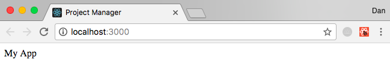
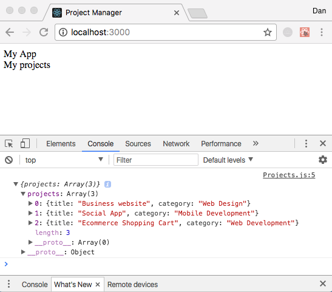
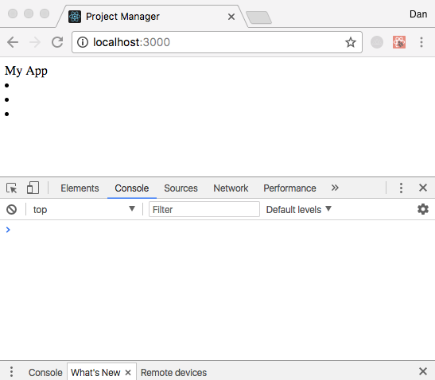
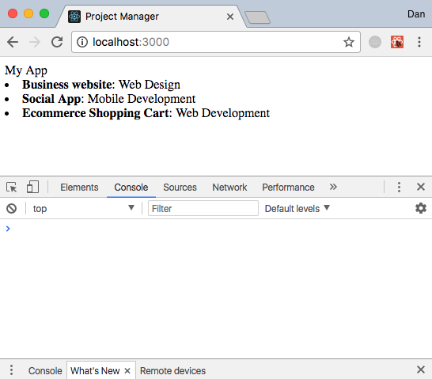
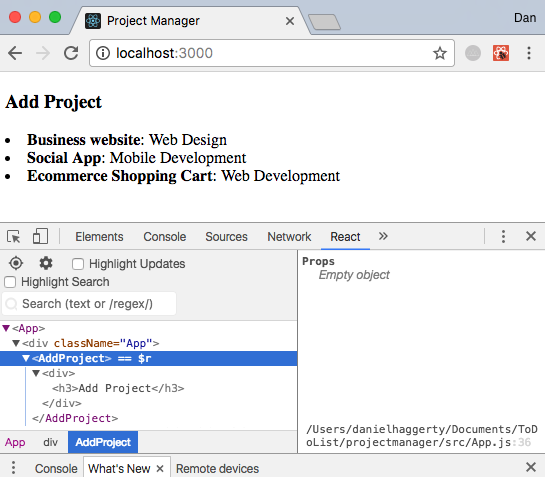
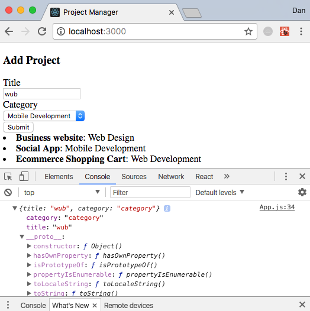
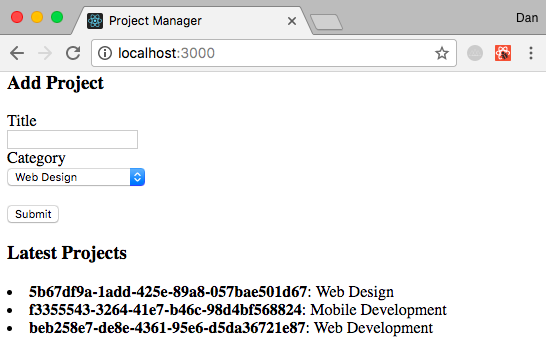

Here I make a walkthrough of how to make a ToDo List in React which can be found at [ToDo.porkpy.com](https://ToDo.porkpy.com/)

This app build is based upon Traversy Media's tutorial which can be found [here](https://www.youtube.com/watch?v=A71aqufiNtQ).

I will walk through, in detail, the steps I went through to produce the final version of the app found on my GitHub page [here](https://github.com/danhagg/ToDoList).

Firstly, make on the GitHub website, create a new repository called "ToDoList".

Make a directory locally to store the app. Then cd into the directory and link the directory to GitHub.
```
echo "# ToDoList" >> README.md
git init
git add README.md
git commit -m "first commit"
git remote add origin git@github.com:danhagg/ToDoList.git
git push -u origin master
```

### v0.2
Let's make a new git branch for production
```
git branch v0.1
git checkout v0.1
```

The nice people at React have created a `create-react-app` tool that creates react app in a single command thereby abnegating the use of webpack or Gulp. We will create and name our app `projectmanager` in the ToDoList directory as follows...

```
create-react-app projectmanager
cd projectmanager
npm start
```
Opening your browser and navigating to `localhost:3000` displays the default React app created in the `projectmanager` folder.

But we wish to modify much of the default code.

Find the `index.html` file in the `public` directory. Strip out all annotations to leave the following code.

```html
<!DOCTYPE html>
<html lang="en">
  <head>
    <meta charset="utf-8">
    <meta name="viewport" content="width=device-width, initial-scale=1, shrink-to-fit=no">
    <meta name="theme-color" content="#000000">

    <link rel="manifest" href="%PUBLIC_URL%/manifest.json">
    <link rel="shortcut icon" href="%PUBLIC_URL%/favicon.ico">

    <title>Project Manager</title>
  </head>
  <body>

    <div id="root"></div>

  </body>
</html>
```

Note that the only `div` has id `root`. The entire app will be passed into, and displayed, via this `div`.

All of React stuff goes in the `src` directory. The `index.js` looks like this.

```js
import React from 'react';
import ReactDOM from 'react-dom';
// import App component from App.js
import App from './App';
import registerServiceWorker from './registerServiceWorker';

// App component will be rendered in the root div
ReactDOM.render(<App />, document.getElementById('root'));
registerServiceWorker();
```

Both the `index.js` and `index.html` files remain pretty untouched from this point forwards. All the development takes place by building components in separate `.js` files and feeding the output of those files into our `App.js` file, which looks like this.

```js
import React, { Component } from 'react';
import './App.css';

// EVERYTHING rendered has to be within ONE element
class App extends Component {
  render () {
    return (
      <div className='App'>
        My App
      </div>
    );
  }
}

export default App;
```

Also delete all the css code in `App.css`. So, now this setup is basically the start point for any React App that we wish to build.
Our stripped down React app, on `localhost:3000`, now looks like this



1. Let's make our first component, with an export statement
2. import the component to the `App.js` and add it to the `render()` function.

Here we go!
1. First Component
Make a new folder called Components in `src` and a new file called `Projects.js`
The following code is also the base for all components.

```js
import React, { Component } from 'react';

// class name defines name of component.
class Projects extends Component {
  render () {
    return (
      // single outer element with className='Component'
      <div className='Projects'>
        My projects
      </div>
    );
  }
}

// export statement with Component name
export default Projects;
```

2. Add import statement `import Projects from './Components/Projects';` to `App.js` and add ``<Projects />`` placeholder into `App div` part of the `render()` function.

```js
import React, { Component } from 'react';
import Projects from './Components/Projects';
import './App.css';

class App extends Component {
  render () {
    return (
      <div className='App'>
        My App
        <Projects />
      </div>
    );
  }
}

export default App;
```

For our ToDo app all our ToDos will not be saved in a database, but will be saved in `state`. What does that mean?

There are two types of data that control a `Component` - `props` and `state`. `Props` is used to represent unchanging data that lasts for the lifetime of the `Component`. On the other hand, `state` can be used to work with changing data. Our ToDo list will contain items that will be added and removed by the user, which will be reflected in the code based upon their `state`.

Firstly, we need to add a `constructor` to the `App` component. And we add our constructor `Projects` - a mock `array` of our of ToDo `objects`.
We also call `super()` in our `constructor` as `this` would remain uninitialized if `super()` was not called.

And we add some JSX `<Projects projects={this.state.projects} />` to the `Projects` handle to take in the data for display.


In `projects.js` we need to add `console.log(this.props);`
```js
import React, { Component } from 'react';

class Projects extends Component {
  render () {
    console.log(this.props);
    return (
      <div className='Projects'>
        My projects
      </div>
    );
  }
}

export default Projects;
```

Now our webpage looks like this and the browser's developer console displays our projects objects showing that the projects component can access the data added to `App.js`.



Let's take a breather and push the current local version `v0.1` of the app to GitHub (and create that version `v0.1` on GitHub).

```
git add -A
git commit -m"First Component in the making"
git push --set-upstream origin v0.1
```

Also, make a GitHub pull request to merge `v0.1` with GitHub `master`. Merge `v0.1` and `master` on GitHub.

Now back in terminal in the ToDoList app root folder... Update local `master`. Make a new local branch `v0.2` to continue development.

```
git checkout master
git pull
git branch v0.2
git checkout v0.2
```

### v0.2
We have an array of objects.
```js
projects: [
  {
    title: 'Business website',
    category: 'Web Design'
  },
  {
    title: 'Social App',
    category: 'Mobile Development'
  },
  {
    title: 'Ecommerce Shopping Cart',
    category: 'Web Development'
  }
]
```
Ideally, we would use a separate component for each item of the array objects and then map through those projects and output the individual object components.

Further explain with an example

In `src/Components` folder make a new file `ProjectItem.js`. Return a list of each project.
```js
import React, { Component } from 'react';

class ProjectItem extends Component {
  render () {
    return (
      <li className='Project'>
      </li>
    );
  }
}

export default ProjectItem;
```

Back in `Projects.js` we add variable projectItems and add an if statement `if (this.props.projects)` to test if there are any projects. If so, we `map` thru the array to pass the projects to the projectItems variable `<ProjectItem key={project.title} project={project} />`
Then add `{projectItems}` to the `Projects div`.
We also need to import the ProjectItem Component with `import ProjectItem from './ProjectItem';` at the top of the `Projects.js file` which now looks like this.


```js
import React, { Component } from 'react';
import ProjectItem from './ProjectItem';

class Projects extends Component {
  render () {
    let projectItems;
    if (this.props.projects) {
      projectItems = this.props.projects.map(project => {
        return (
          <ProjectItem key={project.title} project={project} />
        );
      });
    }
    return (
      <div className='Projects'>
        {projectItems}
      </div>
    );
  }
}

export default Projects;
```

`localhost:3000` looks like this with only bullet points.


This is because our `ProjectItems.js` `<li>` is empty, which we can go and fix now. We are receiving `project` as a property and so it will be passed in as such.

```js
import React, { Component } from 'react';

class ProjectItem extends Component {
  render () {
    return (
      <li className='Project'>
        <strong>{this.props.project.title}</strong>: {this.props.project.category}
      </li>
    );
  }
}

export default ProjectItem;
```

So, in summary.
1. In `App.js`
  - We have a `state` called `projects` in our main app component `this.state = {
    projects: [`
  - We are passing it into `Projects.js` as a `property` with `<Projects projects={this.state.projects} />`
2. Inside `Projects.js`
  - we are mapping through that array and outputting a ProjectItem Component `<ProjectItem key={project.title} project={project}`
3. which has, from `ProjectItem.js`
  - an output of `title` and `category` coded with `<strong>{this.props.project.title}</strong> - {this.props.project.category}`



### v0.3
Normally the `state` information and the keys `projects` are saved in the main `App.js` but the data itself is saved in its own Component.

Let's make that component using a `Life Cycle` method and `componentWillMount`. So the entire contents of the `projects` array in `App.js` is cut out to leave an empty array and pasted into the `componentWillMount` function.

`App.js` now looks like this

```js
import React, { Component } from 'react';
import Projects from './Components/Projects';
import './App.css';

class App extends Component {
  constructor () {
    super();
    this.state = {
      projects: []
    }
  }

  // This is a Life Cycle method that fires off everytime the component is rerendered.

  componentWillMount () {
    this.setState({projects: [
      {
        title: 'Business website',
        category: 'Web Design'
      },
      {
        title: 'Social App',
        category: 'Mobile Development'
      },
      {
        title: 'Ecommerce Shopping Cart',
        category: 'Web Development'
      }
    ]});
  }

  render () {
    return (
      <div className='App'>
        My App
        <Projects projects={this.state.projects} />
      </div>
    );
  }
}

export default App;
```

### v0.4 Include form to allow user to add projects
Create a new Component in src/Components called `AddProject.js`.

Add import to `App.js` and add Component name to `render()`...

```js
import AddProject from './Components/AddProject';

...

      <AddProject />
```

Now we have...



Now we make a large expansion to the `AddProject.js` with a `form`.

The subtle process of taking in data in forms I've now come to realise is full of jiggery-pokery in the code.

Let's begin the nonsense...

`Title` and `category` given `ref` so we can get their values when the user submits the `form`.

We want `categories` to be property of the component. So we set default properties with `static defaultProps`. In addition, we want to map through these `categories` to yield them as `categoryOptions` in the `render()` function. The option is also given a `key` and `value` of `category`.

In addition to the above code accepting the `title` and `category`... to submit the `form` we're gonna...
1. add a handler `onSubmit` to the `form` element
2. add a `handleSubmit` function with an event parameter
3. add a `submit` button.

Also, we wish to add a `constructor` to collect all that information that the user types in. This will collect the data in a `state`.

The `newProject` object in the `contructor` is left empty and will be set once the user inputs and `submits.``

We grab values of form with the `refs` value. And make stubborn demand for a title in the `handleSubmit()` function. We then setState with the `ref values`. We also add a callback function to send that `state` up into the `App.js` which we do in the form of properties with `this.props.addProject(newProject)`. Then we add `addProject` to the `App div` in `App.js`. We also add the handleAddProject function to the App.js file.

The `AddProject.js` file now looks like this.
```js
import React, { Component } from 'react';

class AddProject extends Component {
  constructor() {
    super()
    this.state = {
      newProject:{}
    }
  }

  static defaultProps = {
    categories: ['Web Design', 'Web Development', 'Mobile Development']
  }

  handleSubmit(e) {
    if(this.refs.title.value === ''){
      alert('Title is required');
    } else {
      this.setState({newProject:{
        title: this.refs.title.value,
        category: this.refs.category.value
      }}, function () {
        this.props.addProject(this.state.newProject);
      });
    }
    e.preventDefault();
  }

  render () {
    let categoryOptions = this.props.categories.map(category => {
      return <option key={category} value="category">{category}</option>
    });
    return (
      <div>
        <h3>Add Project</h3>
        <form onSubmit={this.handleSubmit.bind(this)}>
          <div>
            <label>Title</label><br />
            <input type='text' ref='title' />
          </div>
          <div>
            <label>Category</label><br />
            <select ref='category'>
            {categoryOptions}
            </select>
          </div>
          <input type="submit" value="Submit" />
        </form>
      </div>
    );
  }
}

export default AddProject;
```

The `App.js` file now looks like this.
```js
import React, { Component } from 'react';
import Projects from './Components/Projects';
import AddProject from './Components/AddProject';
import './App.css';

class App extends Component {
  constructor () {
    super();
    this.state = {
      projects: []
    }
  }

  // This is a Life Cycle method that fires off everytime the component is rerendered.

  componentWillMount () {
    this.setState({projects: [
      {
        title: 'Business website',
        category: 'Web Design'
      },
      {
        title: 'Social App',
        category: 'Mobile Development'
      },
      {
        title: 'Ecommerce Shopping Cart',
        category: 'Web Development'
      }
    ]});
  }

  handleAddProject (project) {
    console.log(project);
  }

  render () {
    return (
      <div className='App'>
        <AddProject addProject={this.handleAddProject.bind(this)} />
        <Projects projects={this.state.projects} />
      </div>
    );
  }
}

export default App;
```

We now have this functionality following input submission in our browser!



### v0.5
So we have the new project added, instead of just console.logging it with the `handleAddProject()` function, we change the function to set the state of the main `App.js` to hold the new project.

```js
// get state, push new project to it, set state again
handleAddProject (project) {
  let projects = this.state.projects;
  projects.push(project);
  this.setState({projects: projects});
}
```
Install a package to give each project a unique id.
```
npm install --save uuid
```
Add import `uuid` statement in `App.js`.
Add uuid to object properties in `App.js`

```js
import uuid from 'uuid';

componentWillMount () {
  this.setState({projects: [
    {
      id: uuid.v4(),
      title: 'Business website',
      category: 'Web Design'
    }
  })
}
```

And to `AddProject.js` the uuid needs to be add
```js
import uuid from 'uuid';
...


    this.setState({newProject:{
      id: uuid.v4()
    }
  }
})
```

In `ProjectItem.js` we can change `{this.props.project.title}` to `{this.props.project.id}` and view the current unique id's on browser to see that all is hunky-dory.


